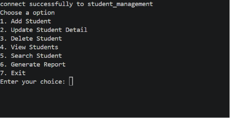
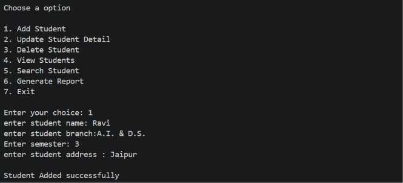
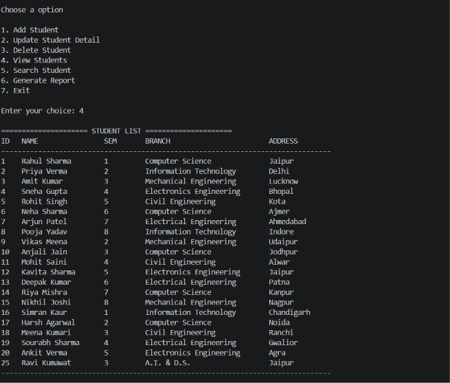
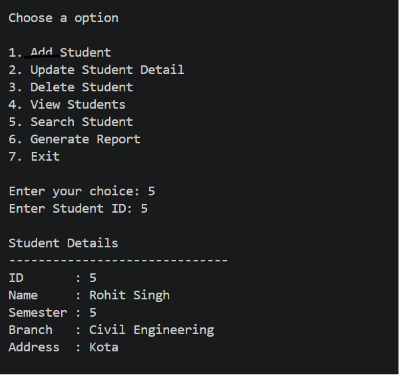
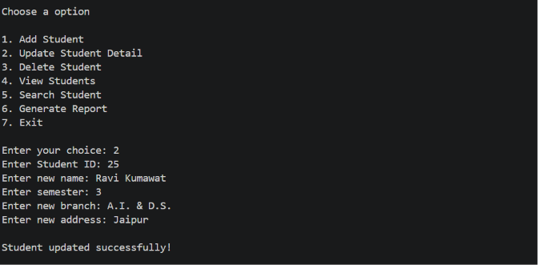
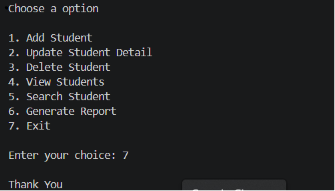

# Student Management System

A simple Student Management System built with Python and MySQL.

## Features

- Add Student
- Update Student
- Delete Student
- View Students
- Search Student
- Generate Report

## Technologies Used

- Python
- MySQL
- mysql-connector-python

## Installation

1. Install Python.
2. Install the required package:

```bash
pip install -r requirements.txt
```

3. Import `student_management_database.sql` into MySQL.
4. Run:

```bash
python main.py
```

## Screenshots

### Main Menu



### Add Student



### View Students


### Search Student


### delete Student


### update Student


### generate Student


### exit program



## Author

Ravi Kumawat